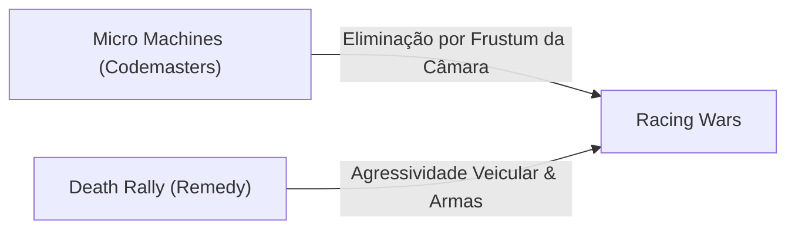

# 01. Histórico, Filosofia de Design e Mercado

## Contextualização da Plataforma AirConsole

**Racing Wars** representa um dos títulos mais emblemáticos no catálogo de jogos multijogador locais da plataforma **AirConsole**, desenvolvida pela startup de tecnologia suíça **N-Dream**. 

A premissa central da AirConsole fundamenta-se na erradicação radical de barreiras de entrada de hardware:
- **Ecrã Principal**: Qualquer computador, televisor inteligente (Smart TV) ou sistema de infoentretenimento automóvel conectado à Internet atua como o recetor e motor de renderização da experiência.
- **Dispositivos de Entrada**: Os telemóveis (smartphones) dos utilizadores operam como periféricos de controlo sem fios via browser ou app dedicada, eliminando a necessidade de consolas proprietárias ou comandos físicos dispendiosos.

---

## O Estúdio de Desenvolvimento: Big Hut Games

O desenvolvimento de Racing Wars esteve a cargo da **Big Hut Games**, um estúdio de videojogos independente originário do Brasil. 

A metodologia de conceção da equipa alinhou-se com a estratégia de criar experiências **casuais com nuances *mid-core***:
1. **Acessibilidade Mecânica Imediata**: Qualquer pessoa, independentemente da sua familiaridade prévia com videojogos, deve ser capaz de pegar no smartphone e compreender a pilotagem em menos de 10 segundos.
2. **Profundidade Estratégica e Competitiva**: Camadas de domínio tático, timing de ativação de itens e conservação de linha de trajetória recompensam jogadores mais experientes, evitando que o jogo se torne monótono.

---

## Influências Ludológicas dos Anos 1990

A fundamentação lúdica de Racing Wars procurou revitalizar a nostalgia dos clássicos de combate veicular da década de 1990, estabelecendo uma ponte conceitual direta entre duas grandes franquias:

- **Micro Machines**: Herdou o sistema de câmara dinâmica e a tensão eliminatória de pista, na qual o piloto que fica para trás é engolido pela margem do ecrã e desqualificado sumariamente.
- **Death Rally**: Forneceu a inspiração para o combate bélico impiedoso, atrito físico entre viaturas e o emprego de armamento letal para sabotar adversários.

---

## Posicionamento de Mercado e Tração Orgânica

O título destacou-se com grande rapidez no ecossistema da AirConsole:
- **Adesão de Utilizadores**: Superou a marca de **500.000 jogadores únicos** de forma puramente orgânica, sem o suporte de campanhas de publicidade paga.
- **Loop de Replay Imediato**: A estrutura de rondas propositadamente curtas (com duração média de 30 a 60 segundos por rodada) instiga um ciclo psicológico contínuo de repetição imediata ("apenas mais uma partida").
- **Fenomenologia Social de Sofá (*Couch Multiplayer*)**: O jogo foi projetado para encontros sociais e salas de estar, gerando reações emocionais efervescentes:
  - Rivalidades verbais instantâneas;
  - Celebrações coletivas em momentos de reviravolta;
  - Formação espontânea de alianças táticas temporárias entre os jogadores atrasados com o intuito de neutralizar os pilotos com maior pontuação acumulada.
