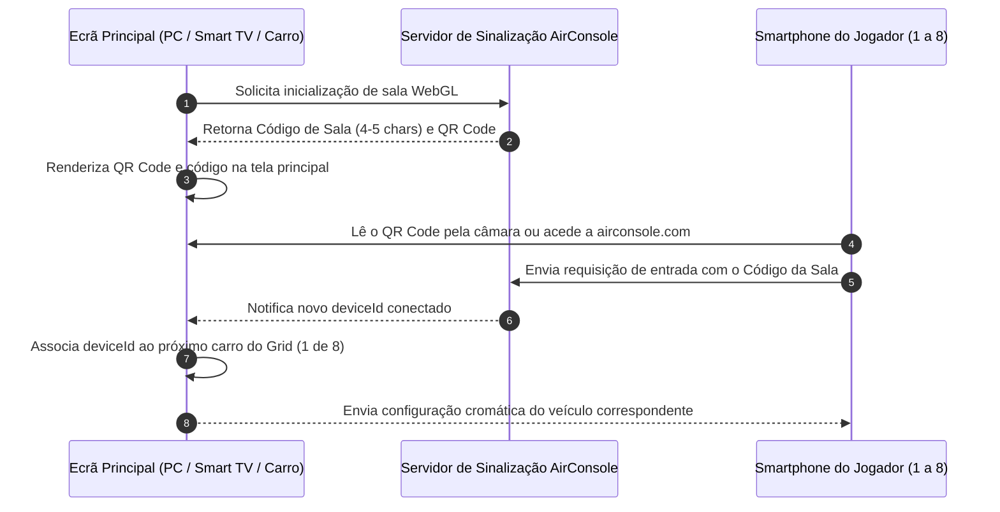

# 05. Controles Mobile e Experiência Multijogador

## Ciclo de Emparelhamento e Conexão (1 a 8 Jogadores)

A capacidade de acomodar até **8 jogadores simultâneos no mesmo ecrã** sem exigir gamepads dedicados constitui a principal proposta social da plataforma AirConsole e de Racing Wars. O fluxo de adesão foi projetado com fricção próxima de zero:



### 1. Papel do Master Controller
O primeiro smartphone a estabelecer conexão na sessão é designado pela API como **Master Controller** (`deviceId` dominante). Apenas este dispositivo detém permissão para:
- Navegar pela interface dos menus principais;
- Escolher a Copa (*Fast Cup*, *Super Cup* ou *War Cup*);
- Selecionar o circuito da corrida;
- Iniciar e reiniciar as partidas.

### 2. Identificação por Codificação Cromática
Cada `deviceId` conectado recebe um carro com uma tonalidade contrastante na tela da TV (Vermelho, Azul, Amarelo, Verde, Laranja, Roxo, Ciano e Rosa). Concomitantemente, **o ecrã do telemóvel do participante altera a sua cor de fundo para a exata tonalidade do seu automóvel**, garantindo reconhecimento visual imediato.

---

## Ergonomia Mobile: A Filosofia "Screen-Blind UX"

Controlar veículos em alta velocidade em telas capacitivas planas apresenta um dilema severo de usabilidade: **a ausência de resposta tátil física** (ausência de botões analógicos ou gatilhos mecânicos). Em um jogo de corrida rápida com eliminação por câmara, se o jogador desviar os olhos da TV para o celular por mais de 1,5 segundos para procurar um botão virtual, o seu veículo perderá a linha de curva e será eliminado sumariamente.

Para contornar este problema, a Big Hut Games estruturou uma interface minimalista dividida em **dois grandes blocos funcionais em modo paisagem (*landscape*)**:

```
+-----------------------------------+-----------------------------------+
|                                   |                                   |
|      QUADRANTE ESQUERDO           |      QUADRANTE DIREITO            |
|                                   |                                   |
|       DIREÇÃO CEGA                |      DISPARO DE AÇÃO ÚNICA        |
|    (Blind Touch Steering)         |     (Item / Nitro / Whomp)        |
|                                   |                                   |
|   Toque / Deslize em qualquer     |    Toque amplo em qualquer ponto  |
|   ponto da metade esquerda        |    da metade direita para usar    |
|   para esterçar o volante         |    o power-up armazenado          |
|                                   |                                   |
+-----------------------------------+-----------------------------------+
         [ACELERAÇÃO AUTOMATIZADA / CRUISE CONTROL PERMANENTE]
```

### 1. Aceleração Automatizada (*Cruise Control*)
O motor de física aplica aceleração contínua aos carros em linha reta. Esta decisão de design foi crucial para eliminar a necessidade de manter o polegar pressionando um pedal de acelerador virtual, reduzindo a fadiga muscular e permitindo concentração total na trajetória e no combate.

### 2. Quadrante Esquerdo: Direção Cega (*Blind Steering*)
A metade esquerda do display não exige posicionamento sobre um direcional desenhado. Qualquer toque na região esquerda registra o ponto de ancoragem inicial; deslizar ligeiramente o polegar para a esquerda ou direita aplica torque imediato de viragem ao veículo, permitindo pilotagem por memória muscular sem olhar para o telemóvel.

### 3. Quadrante Direito: Disparo de Ação Única
A metade direita atua como um grande gatilho unificado. Basta bater o polegar direito em qualquer área da superfície direita para detonar o item disponível (aceleração do Nitro, soltura de Mina, disparo do Rocket ou acionamento do Whomp).

---

## Supressão de Latência Tátil no Navegador

Por padrão, motores de navegação móvel baseados em WebKit (iOS Safari) e Blink (Android Chrome) introduzem um atraso de aproximadamente **300 milissegundos** em eventos de clique convencionais para verificar se o usuário está executando um toque duplo de zoom (*double-tap to zoom*).

Para atingir a responsividade necessária em um jogo arcade:
- A interface mobile de Racing Wars utiliza o pacote especializado `airconsole-controls`;
- O código cancela os manipuladores normais de clique e escuta diretamente eventos brutos de toque (`touchstart`, `touchmove` e `touchend`);
- Com isso, o comando tátil é processado e despachado para a camada de rede no mesmo milissegundo em que o dedo entra em contato com o vidro do smartphone.
