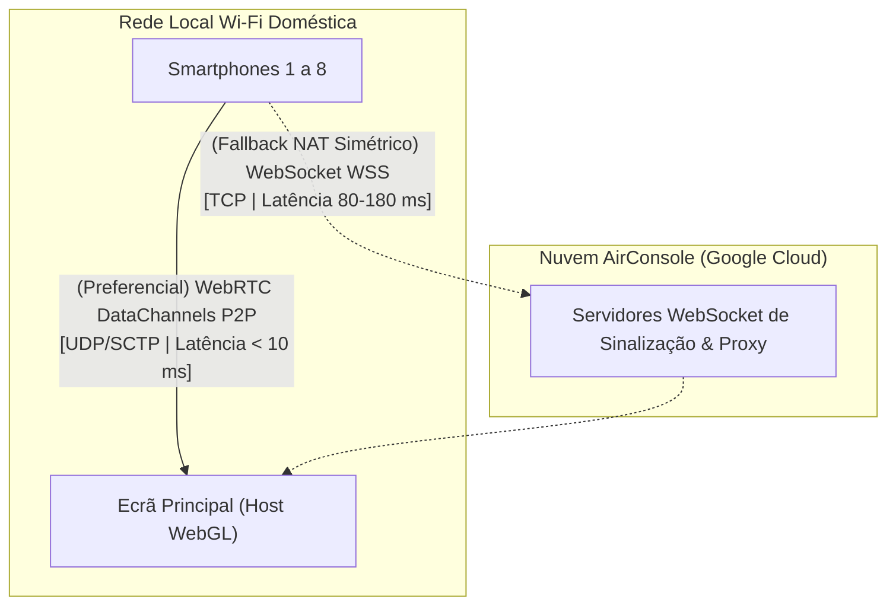

# 06. Arquitetura de Rede e Otimização de Dados

## Concorrência de Rede para 8 Conexões Simultâneas

O suporte a 8 condutores competindo em tempo real impõe uma carga severa de comunicação. Cada terminal móvel transmite constantemente vetores de esterçamento e pulsos de disparo a taxas de atualização que variam entre 30 Hz e 60 Hz. 

Em uma sessão cheia, isso representa o tráfego de **centenas de mensagens por segundo convergindo para um único cliente de renderização WebGL**.

---

## Topologia de Rede Híbrida (WebRTC vs. WebSockets)

Para equilibrar latência ultra-baixa com resiliência de conectividade diante das mais variadas configurações de roteadores domésticos, a AirConsole emprega uma arquitetura de transmissão em dois níveis:

### 1. Canal Primário: WebRTC DataChannels (P2P Local)
- **Protocolo**: SCTP encapsulado sobre UDP.
- **Funcionamento**: Quando os telemóveis e o ecrã hospedeiro compartilham a mesma rede Wi-Fi (sem isolamento de clientes ativo), o servidor de sinalização estabelece conexões P2P diretas via roteador local.
- **Desempenho**: **Latência inferior a 10 milissegundos**, proporcionando resposta de direção instantânea sem sensação de descolamento do veículo.

### 2. Canal de Fallback: WebSockets em Nuvem
- **Protocolo**: WSS seguro sobre TCP.
- **Funcionamento**: Se a rede do usuário possuir regras restritivas de NAT Simétrico, firewalls corporativos ou perda severa de pacotes UDP que impeçam o handshake ICE do WebRTC, a biblioteca redireciona o tráfego através de servidores em nuvem da AirConsole hospedados no Google Cloud Platform.
- **Desempenho**: A latência de ida e volta (*Round-Trip Time - RTT*) eleva-se para a faixa de **80 a 180 ms**. Em pistas técnicas de Racing Wars com curvas fechadas (como Downtown), esse atraso torna o controle perceptivelmente mais solto.

---

## Mitigação de Garbage Collection via StructDataBuffer

No ecossistema Unity compilado para WebGL, o coletor de lixo (*Garbage Collector*) opera sobre a memória gerenciada do WebAssembly e pode causar interrupções perceptíveis na taxa de quadros (*micro-stutters*) caso ocorram muitas alocações efêmeras por segundo.

### O Problema do Envio em JSON
Se 8 dispositivos móveis transmitissem comandos utilizando strings textuais em formato JSON a 60 Hz:
$$\text{Mensagens} = 8 \times 60 = 480 \text{ mensagens JSON/segundo}$$
Essa avalanche de strings forçaria a alocação e destruição contínua de memória gerenciada, disparando o Garbage Collector a cada poucos segundos e congelando a renderização do jogo em momentos cruciais de curvas e saltos.

### A Solução Binária: StructDataBuffer
Para sanar esse gargalo, a plataforma AirConsole implementou o serializador binário **`StructDataBuffer`**:
- Os dados brutos de direção (eixo X) e ações de botões são empacotados diretamente em formatos binários tipados de tamanho fixo (**`ArrayBuffers`** em JavaScript / `byte[]` em C#);
- **Eliminação de Alocações Desnecessárias**: Os buffers são reutilizados continuamente em memória estática, reduzindo as alocações no heap gerenciado a zero;
- **Eficiência de Processamento**: O parsing binário de comandos é processado com uma velocidade **1,5 vezes superior** à desserialização tradicional de strings JSON textuais.
