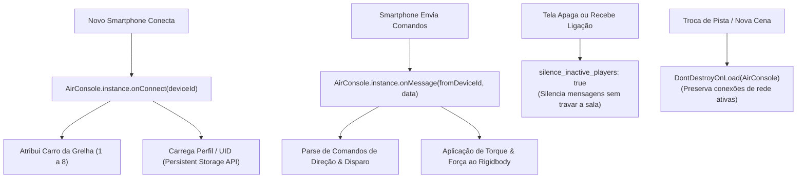

# 07. Engenharia Unity WebGL e Adaptação Automotiva

## Pipeline de Compilação Unity WebGL

A instância executável de **Racing Wars** foi desenvolvida no motor de jogos Unity e compilada para o ecossistema WebGL utilizando o pipeline **IL2CPP + Emscripten**:
- O código de gameplay em C# é convertido em código C++ nativo via IL2CPP;
- O compilador Emscripten converte esse código em binários de alto desempenho **WebAssembly (WASM)**;
- O módulo WASM resultante executa com velocidade quase nativa sobre os motores JavaScript (como o V8 no Google Chrome ou nos navegadores integrados de Smart TVs).

---

## Restrições Extremas de Recursos e Gestão de Memória

A plataforma AirConsole exige compatibilidade com dispositivos de sala de estar com especificações de hardware extremamente reduzidas. O dispositivo de referência para homologação foi o **Xiaomi Mi TV Stick**, dotado de um processador ARM Cortex-A53 quad-core a 1.2 GHz e apenas **1 GB de memória RAM total compartilhada**.

Para operar com fluidez nesses aparelhos, a Big Hut Games teve de obedecer a rígidos orçamentos computacionais:

| Métrica / Parâmetro | Limite Operacional | Estratégia Adotada |
| :--- | :--- | :--- |
| **Consumo de Memória RAM** | $\le 512 \text{ MB}$ em runtime | Impede o acionamento do terminador de processos do sistema (*Android OOM Killer*). |
| **Download Inicial** | $\le 50 \text{ MB}$ | Assegura que o jogo inicie em poucos segundos após a leitura do QR Code. |
| **Carregamento Assíncrono** | Sob demanda | Pistas secundárias, malhas pesadas e trilhas sonoras utilizam *Unity AssetBundles*. |
| **Taxa de Quadros (Smart TV)** | Mínimo contínuo de 25 FPS | Redução drástica de polígonos, iluminação pré-cozida (*baked*) e shaders simples. |
| **Taxa de Quadros (PC / Laptops)** | 30 a 60 FPS estáveis | Execução com folga mesmo em processadores gráficos integrados básicos (Intel HD Graphics). |

---

## Integração com o Plugin AirConsole (`NDream.AirConsole`)

O ciclo de vida e a gestão de comunicação no Unity apoiam-se no plugin oficial da AirConsole:



### 1. Preservação de Sessão entre Cenas (`DontDestroyOnLoad`)
O GameObject que hospeda a instância singleton `AirConsole.instance` é protegido com a chamada nativa `DontDestroyOnLoad()`. Isso garante que as conexões de rede com os 8 smartphones não sejam redefinidas quando o jogo descarrega um circuito e carrega o próximo cenário.

### 2. Resiliência a Desconexões com Player Silencing
O construtor da biblioteca é configurado com a diretiva:
```csharp
AirConsoleSettings.silence_inactive_players = true;
```
Se o telemóvel de um competidor bloquear a tela por inatividade ou receber uma chamada telefónica inesperada, a API suspende e silencia temporariamente as suas mensagens pendentes. Isso evita exceções no gestor de rede da Unity e permite que a corrida continue inalterada para os demais 7 jogadores.

### 3. Persistência de Dados em Nuvem (`Persistent Storage API`)
A persistência do progresso do jogador (como conquistas e desbloqueio de skins de veículos) é gerenciada pela *Persistent Storage API*, que disponibiliza até **1 MB de armazenamento chave-valor na infraestrutura em nuvem** para cada identificador exclusivo (UID) autenticado pelo utilizador.

---

## Adaptação para Telas Panorâmicas de Automóveis (Android Automotive)

Com a evolução da AirConsole para o setor automobilístico — estabelecendo parcerias de grande notoriedade com montadoras globais como o **BMW Group** —, Racing Wars passou a ser executado nos painéis centrais de infoentretenimento baseados em **Android Automotive OS (AOSP)**.

### O Desafio das Proporções e Elementos Nativos
Os ecrãs dos carros modernos apresentam formatos atípicos (proporções ultrawide e formatos curvos), além de exibir elementos nativos fixos do próprio veículo (controles táteis de climatização, velocímetro digital, notificações de bordo) que cobrem parcialmente as bordas da tela.

### Resolução Dinâmica com `OnSafeAreaChanged`
Para prevenir que a pontuação dos 8 jogadores ou as curvas dos circuitos fiquem encobertas pelos comandos do automóvel, o jogo monitora ativamente o evento:

```csharp
AirConsole.instance.OnSafeAreaChanged += OnSafeAreaChanged;

void OnSafeAreaChanged(Rect safeArea) {
    // Reajusta a área de renderização das câmaras
    mainCamera.pixelRect = safeArea;

    // Recalibra dinamicamente as âncoras dos componentes de UI
    hudCanvasScaler.ApplySafeArea(safeArea);
}
```

Ao receber as coordenadas seguras emitidas pelo sistema operacional veicular, o motor redimensiona dinamicamente a área útil de projeção (`Camera.pixelRect`) e reposiciona as âncoras da interface (*Canvas UI*), assegurando visibilidade total independentemente do modelo do veículo.
