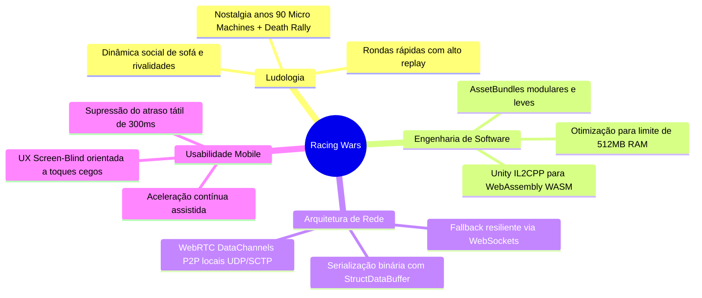

# 08. Modelo Comercial, Estabilidade e Conclusões

## Modelo Comercial e Limitações de Acesso

A arquitetura de monetização da AirConsole divide a experiência entre um patamar de acesso livre e um serviço de assinatura premium:

### 1. Pacote Gratuito (Starter Pack)
- **Limite de Participantes**: O plano básico limita as sessões a no máximo **2 a 3 jogadores locais**.
- **Monetização por Anúncios**: As transições entre as rondas e os carregamentos de pistas sofrem interrupções periódicas com publicidade visual em vídeo.
- **Impacto no Jogo**: Organizar partidas em grupo completo de 8 participantes torna-se inviável no pacote gratuito sem uma assinatura na sala.

### 2. Assinatura AirConsole Hero e o Mecanismo de "Desbloqueio Partilhado"
A assinatura Hero destrava todo o potencial competitivo do título:
- **Suporte Total para 8 Jogadores**: Permite sessões com grid completo de até 8 veículos simultâneos;
- **Eliminação Completa de Anúncios**: Fluidez contínua entre as rodadas sem qualquer interrupção comercial;
- **Mecânica do Desbloqueio Partilhado (*Shared Unlock*)**: Trata-se da principal virtude do ecossistema. **Não é exigido que os 8 participantes paguem assinaturas individuais**. Se apenas **um único jogador** conectado à sessão possuir o AirConsole Hero ativo no seu smartphone, toda a sala é promovida automaticamente ao estatuto premium, concedendo os benefícios completos aos outros 7 participantes conectados àquele ecrã.

---

## Diagnóstico de Estabilidade e Desempenho

Apesar do sucesso de público e da inovação social de Racing Wars, a manutenção de um jogo com 8 conexões em tempo real sobre navegadores enfrentou desafios operacionais:

### 1. Variações de Resposta Direcional (*Input Lag*)
Quando a rede local sofre interferências graves ou quando a topologia força a comutação para o canal WebSocket na nuvem, o atraso de transmissão pode ultrapassar os **100 ms**. Em pistas de precisão milimétrica como Downtown e Water Hill, esse atraso resulta em subesterçamento tardio e colisões involuntárias com o cenário.

### 2. Falhas de Concorrência com 8 Jogadores
- **Falso Vencedor no Respawn**: Sob lotação máxima de 8 carros, o processamento de renascimentos no início das rondas 2 ou 3 apresentava condições de corrida (*race conditions*) ocasionais no script de gerenciamento, no qual o jogo registrava erroneamente que restava apenas um concorrente ativo e encerrava a rodada de forma prematura.
- **Conflito de Matriz de Dano (Nitro vs. Minas)**: Foi documentado um bug no qual os quadros de invulnerabilidade aplicados durante o disparo do *Speed Boost* sobrepunham incorretamente a rotina de detonação das *Minas Terrestres*, permitindo que veículos acelerados atravessassem explosivos sem sofrer qualquer dano físico.

### 3. Congelamento de Versão na v1.0.10
Diante do encerramento do ciclo ativo de produção pelo estúdio independente Big Hut Games, a equipe de engenharia da AirConsole decidiu **congelar a build na versão funcional 1.0.10**. Em vez de refatorar profundamente a arquitetura de física da Unity, a plataforma optou por expurgar os dois circuitos problemáticos (*Ice Circuit* e *Volcano/Lava*), mantendo os 4 circuitos estáveis em rotação permanente no catálogo.

---

## Conclusões Técnicas e Ludológicas

Racing Wars consolidou-se como um divisor de águas na história da AirConsole ao demonstrar que o conceito de multijogador local de sala de estar (*couch multiplayer*) pode prosperar na era pós-consolas dedicadas:

Do ponto de vista de desenvolvimento de software distribuído na Web, o projeto sintetiza o equilíbrio entre **acessibilidade móvel imediata, desempenho computacional rigoroso sob restrições de memória e engenharia de rede em tempo real**. A sua longevidade como um dos jogos mais jogados da AirConsole atesta a eficácia dessa integração técnica e criativa.
